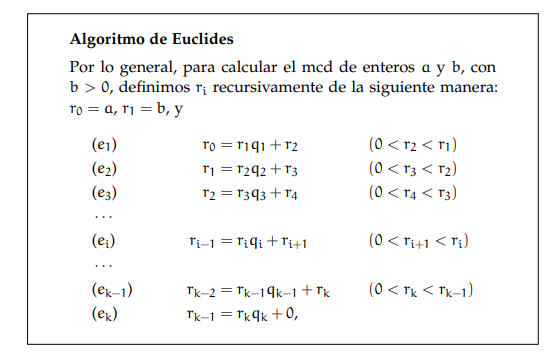
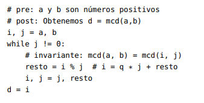

# Algoritmo-de-Euclides
Sean a y b enteros con b > 0, entonces el máximo común divisor es el último resto no nulo obtenido en el algoritmo de Euclides (con la notación del cuadro 1 es rk).

Demostración. Observar que aplicando repetidas veces la fórmula (3.3.1)
obtenemos
rk = mcd(rk, 0) = mcd(rk−1, rk) = mcd(rk−2, rk−1) = · · ·
· · · = mcd(r2, r3) = mcd(r1, r2) = mcd(r0, r1) = mcd(a, b)
Observación (*). El algoritmo de Euclides es fácilmente implementable en
un lenguaje de programación. A continuación una versión del mismo en
pseudocódigo.
Algoritmo de Euclides

Luego, al terminar el ciclo while, es decir cuando j = 0, tenemos que
mcd(a, b) = mcd(i, 0) = i.

